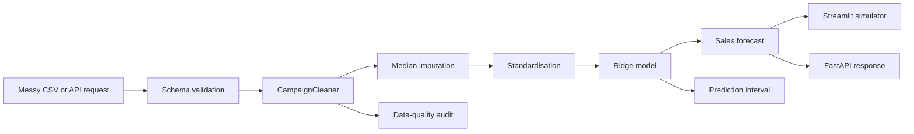

# InfluenceLift AI

> **Predict influencer campaign sales before the budget is spent.**

[](https://influencelift-ai.streamlit.app)
[](https://github.com/mohit231007/influencelift-ai/actions/workflows/ci.yml)
[](https://github.com/mohit231007/influencelift-ai/actions/workflows/deployment-smoke.yml)
[](https://www.python.org/)
[](LICENSE)
[](MODEL_CARD.md)

**InfluenceLift AI** is an end-to-end marketing analytics platform that turns unreliable influencer-campaign data into defensible sales forecasts. It combines an auditable data-quality engine, reproducible model training, an interactive Streamlit decision simulator, and a FastAPI inference service.

### [Launch the live application](https://influencelift-ai.streamlit.app) · [Read the model card](MODEL_CARD.md) · [Explore the architecture](docs/architecture.md)

## Live demo

The public application is available at:

**https://influencelift-ai.streamlit.app**

Try the campaign predictor with:

| Field | Example |
|---|---:|
| Followers | `125K` |
| Engagement rate | `3.7%` |
| Ad spend | `£5,500` |
| Content quality | `8.2` |

The live application also supports:

- Batch CSV uploads and downloadable predictions
- Campaign scenario comparison
- Prediction intervals and extrapolation warnings
- Data-quality correction summaries
- Model metrics and training-range inspection

The hosted demo trains a deterministic synthetic model because the original challenge dataset is not redistributed. The validated case-study metrics below come from the original supplied data.

## Why this project matters

Marketing teams frequently receive campaign data with currency symbols, percentages, mixed follower units, missing values, impossible values, and extreme outliers. A model that assumes clean inputs will fail precisely when a business needs it most.

InfluenceLift AI addresses both parts of the problem:

1. **Make messy campaign data reliable.**
2. **Use the cleaned data to forecast sales and compare decisions before budget is committed.**

## Key capabilities

- Parse values such as `£5,000`, `3.2%`, `125K`, and `1.4M`
- Detect missing fields, scale anomalies, negative spend, invalid quality scores, and schema problems
- Train a leakage-safe scikit-learn pipeline with imputation, scaling, and regularised regression
- Evaluate models with out-of-fold RMSE, MAE, R², and fold stability
- Generate campaign-level predictions and empirical prediction intervals
- Simulate changes to followers, engagement, spend, and content quality
- Upload batches through Streamlit and download prediction results
- Serve predictions through documented FastAPI endpoints
- Validate runtime behaviour through automated deployment smoke tests
- Run linting, tests, and compilation across Python 3.10, 3.11, and 3.12

## Validated case-study result

The original case study compared linear and nonlinear alternatives using five-fold cross-validation. The simpler regularised model generalised best.

| Model | RMSE | MAE | R² |
|---|---:|---:|---:|
| **Tuned Ridge (selected)** | **2,000.36** | **1,592.73** | **0.4925** |
| Linear Regression | 2,000.36 | 1,592.73 | 0.4925 |
| Tuned XGBoost | 2,016.98 | 1,609.08 | 0.4840 |

The fold-level RMSE standard deviation was approximately **44.57 units**, indicating stable validation performance. These metrics describe predictive performance on the supplied case-study data and should not be interpreted as universal benchmarks.

## Architecture



## Repository layout

```text
influencelift-ai/
├── app/                         # Streamlit product interface
├── api/                         # FastAPI service
├── src/influencelift/           # Reusable Python package
├── scripts/                     # Train, predict, demo-data, and QA commands
├── tests/                       # Unit and API tests
├── data/sample/                 # Synthetic public demonstration data
├── docs/                        # Architecture, deployment, and methodology
├── notebooks/                   # Original analytical case study
├── reports/                     # Submission-ready case-study report
├── .github/workflows/           # CI and deployment smoke tests
├── Dockerfile
├── docker-compose.yml
└── pyproject.toml
```

## Quick start

### 1. Clone and install

```bash
git clone https://github.com/mohit231007/influencelift-ai.git
cd influencelift-ai
python -m venv .venv
```

Activate the environment:

```bash
# Windows PowerShell
.venv\Scripts\Activate.ps1

# macOS/Linux
source .venv/bin/activate
```

Install the package:

```bash
python -m pip install --upgrade pip
pip install -e ".[dev]"
```

### 2. Generate demo data and train a model

```bash
python scripts/generate_demo_data.py --rows 1500
python scripts/train.py \
  --input data/generated/demo_train.csv \
  --model-output artifacts/model_bundle.joblib \
  --metrics-output artifacts/metrics.json
```

On Windows PowerShell, place the command on one line or replace `\` with the PowerShell continuation character.

### 3. Launch the application

```bash
streamlit run app/Home.py
```

### 4. Launch the API

```bash
uvicorn api.main:app --reload --port 8000
```

Open the generated API documentation at `http://127.0.0.1:8000/docs`.

## One-command Windows QA

The repository includes an end-to-end PowerShell QA workflow:

```powershell
Set-ExecutionPolicy -Scope Process Bypass
.\scripts\qa_local.ps1 -LaunchApp -LaunchApi
```

It creates a virtual environment, installs dependencies, runs linting and tests, compiles the code, trains a QA model, generates batch predictions, and launches both services.

## Docker

Run Streamlit and FastAPI together:

```bash
docker compose up --build
```

- Streamlit: `http://localhost:8501`
- FastAPI docs: `http://localhost:8000/docs`

## Command-line prediction

```bash
python scripts/predict.py \
  --input data/sample/synthetic_campaigns.csv \
  --model artifacts/model_bundle.joblib \
  --output artifacts/predictions.csv
```

## API example

```bash
curl -X POST "http://localhost:8000/predict" \
  -H "Content-Type: application/json" \
  -d '{
    "followers": "125K",
    "engagement_rate": "3.7%",
    "ad_spend": "£5,500",
    "content_quality": 8.2,
    "timestamp": "2026-07-17"
  }'
```

Example response:

```json
{
  "predicted_sales_units": 13333,
  "prediction_lower_bound": 9352,
  "prediction_upper_bound": 17314,
  "data_quality_status": "valid_with_corrections",
  "corrections_applied": [
    "followers_explicit_scale_parsed",
    "engagement_percentage_symbol_removed",
    "spend_currency_symbol_removed"
  ],
  "extrapolation_warnings": [],
  "model_version": "demo-1.0.0"
}
```

Prediction values depend on the trained model bundle.

## Data policy

The original challenge datasets are **not committed** because the repository does not assume redistribution rights. The public sample under `data/sample/` is synthetic and safe for demonstrations and automated tests.

To train with authorised source files, place them locally under `data/raw/`. That directory is ignored by Git.

## Business interpretation

The selected model is useful for:

- Pre-campaign sales forecasting
- Comparing candidate creators or campaign configurations
- Testing budget and content-quality scenarios
- Identifying unreliable input data before decisions are made
- Communicating model uncertainty instead of presenting forecasts as guarantees

The model estimates associations, not causal effects. Increasing spend does not automatically cause the predicted sales increase because campaign assignment is not randomised. See [MODEL_CARD.md](MODEL_CARD.md) for limitations and responsible-use guidance.

## Quality checks

```bash
ruff check .
pytest -q
python -m compileall src api app scripts
```

## Documentation

- [System architecture](docs/architecture.md)
- [Deployment guide](docs/deployment.md)
- [Data-cleaning design](docs/data-cleaning.md)
- [Model development](docs/model-development.md)
- [Model card](MODEL_CARD.md)
- [Contribution guide](CONTRIBUTING.md)
- [Security policy](SECURITY.md)

## Roadmap

- [x] Reusable cleaning and model pipeline
- [x] Streamlit predictor and scenario simulator
- [x] FastAPI prediction endpoints
- [x] Synthetic demonstration data
- [x] Tests and continuous integration
- [x] Deployment smoke testing
- [x] Hosted public demo
- [ ] Local prediction explanations
- [ ] MLflow experiment tracking
- [ ] Evidently drift reports
- [ ] Constrained campaign-budget optimisation


## Portfolio collaboration

InfluenceLift AI combines marketing analytics, portfolio positioning,
and production-style machine-learning engineering.

### Aarushi Rai

- Marketing-use-case framing and business positioning
- Interpretation of campaign reach, engagement, spend, content quality, and sales
- Campaign scenario and decision-support framing
- Recruiter-facing portfolio storytelling and marketing communication

### Mohit Bhatnagar

- Data cleaning and auditable data-quality policies
- Statistical modelling, cross-validation, and model selection
- Machine-learning pipeline and prediction intervals
- Streamlit and FastAPI implementation
- Testing, Docker, CI/CD, deployment, and technical documentation

[Read Aarushi Rai's complete portfolio case study](AARUSHI_PORTFOLIO_CASE_STUDY.md)

### Portfolio resources

- [System Design Portfolio Defense Guide](portfolio-assets/pdf/System_Design_Portfolio_Defense_Guide.pdf)
- [Coding Guide](portfolio-assets/pdf/Coding_Guide.pdf)
- [Coding Interview Workbook](portfolio-assets/pdf/Coding_Interview_Workbook.pdf)
- [Interview Question Bank](portfolio-assets/pdf/Interview_Question_Bank.pdf)
- [Portfolio Playbook](portfolio-assets/pdf/Portfolio_Playbook.pdf)
- [System Design Diagram Pack](portfolio-assets/pdf/System_Design_Diagram_Pack.pdf)
- [LinkedIn Marketing Kit](portfolio-assets/pdf/LinkedIn_Marketing_Kit.pdf)

## Author

**Mohit Bhatnagar** — Data Scientist

Built as an open-source demonstration of applied data science, marketing analytics, reliable ML engineering, and business-oriented model communication.

## License

Released under the [MIT License](LICENSE).
