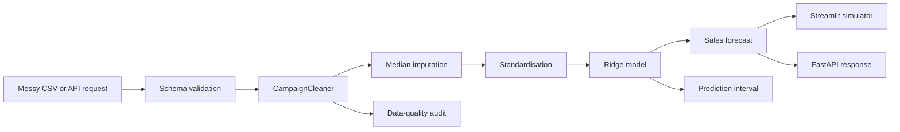

# InfluenceLift AI

> **Predict influencer campaign sales before the budget is spent.**

[](https://github.com/mohit231007/influencelift-ai/actions/workflows/ci.yml)
[](https://www.python.org/)
[](LICENSE)
[](MODEL_CARD.md)

**InfluenceLift AI** is an end-to-end marketing analytics project that turns unreliable influencer-campaign data into defensible sales forecasts. It combines a configurable data-quality engine, reproducible model training, an interactive Streamlit decision simulator, and a FastAPI inference service.

The project is intentionally designed as a production-style portfolio rather than a single notebook.

## Why this project matters

Marketing teams frequently receive campaign data with currency symbols, percentages, mixed follower units, missing values, impossible values, and extreme outliers. A model that assumes clean inputs will fail exactly when a business needs it most.

InfluenceLift AI addresses both parts of the problem:

1. **Make messy campaign data reliable.**
2. **Use the cleaned data to forecast sales and compare decisions before budget is committed.**

## Key capabilities

- Parse values such as `£5,000`, `3.2%`, `125K`, and `1.4M`.
- Detect missing fields, scale anomalies, negative spend, invalid quality scores, and schema problems.
- Train a leakage-safe scikit-learn pipeline with imputation, scaling, and regularised regression.
- Evaluate models with out-of-fold RMSE, MAE, R², and fold stability.
- Generate campaign-level predictions and empirical prediction intervals.
- Simulate changes to followers, engagement, spend, and content quality.
- Upload batches through Streamlit and download prediction results.
- Serve predictions through documented FastAPI endpoints.
- Run tests, linting, and packaging checks automatically with GitHub Actions.

## Validated case-study result

The original case study compared linear and nonlinear alternatives using five-fold cross-validation. The simpler regularised model generalised best.

| Model | RMSE | MAE | R² |
|---|---:|---:|---:|
| **Tuned Ridge (selected)** | **2,000.36** | **1,592.73** | **0.4925** |
| Linear Regression | 2,000.36 | 1,592.73 | 0.4925 |
| Tuned XGBoost | 2,016.98 | 1,609.08 | 0.4840 |

The fold-level RMSE standard deviation was approximately **44.57 units**, indicating stable validation performance. These metrics describe predictive performance on the supplied case-study data and should not be interpreted as universal benchmarks.

## Architecture



## Repository layout

```text
influencelift-ai/
├── app/                         # Streamlit product interface
├── api/                         # FastAPI service
├── src/influencelift/           # Reusable Python package
├── scripts/                     # Train, predict, and demo-data commands
├── tests/                       # Unit and API tests
├── data/sample/                 # Synthetic public demonstration data
├── docs/                        # Architecture and methodology
├── notebooks/                   # Original analytical case study
├── reports/                     # Submission-ready case-study report
├── .github/workflows/           # Continuous integration
├── Dockerfile
├── docker-compose.yml
└── pyproject.toml
```

## Quick start

### 1. Clone and install

```bash
git clone https://github.com/mohit231007/influencelift-ai.git
cd influencelift-ai
python -m venv .venv
```

Activate the environment:

```bash
# Windows PowerShell
.venv\Scripts\Activate.ps1

# macOS/Linux
source .venv/bin/activate
```

Install the package:

```bash
python -m pip install --upgrade pip
pip install -e ".[dev]"
```

### 2. Generate demo data and train a model

```bash
python scripts/generate_demo_data.py --rows 1500
python scripts/train.py \
  --input data/generated/demo_train.csv \
  --model-output artifacts/model_bundle.joblib \
  --metrics-output artifacts/metrics.json
```

On Windows PowerShell, place the command on one line or replace `\` with the PowerShell continuation character.

### 3. Launch the application

```bash
streamlit run app/Home.py
```

### 4. Launch the API

```bash
uvicorn api.main:app --reload --port 8000
```

Open the automatically generated API documentation at `http://127.0.0.1:8000/docs`.

## Docker

Run the Streamlit application and FastAPI service together:

```bash
docker compose up --build
```

- Streamlit: `http://localhost:8501`
- FastAPI docs: `http://localhost:8000/docs`

## Command-line prediction

```bash
python scripts/predict.py \
  --input data/sample/synthetic_campaigns.csv \
  --model artifacts/model_bundle.joblib \
  --output artifacts/predictions.csv
```

## API example

```bash
curl -X POST "http://localhost:8000/predict" \
  -H "Content-Type: application/json" \
  -d '{
    "followers": "125K",
    "engagement_rate": "3.7%",
    "ad_spend": "£5,500",
    "content_quality": 8.2,
    "timestamp": "2026-07-17"
  }'
```

Example response:

```json
{
  "predicted_sales_units": 10842,
  "prediction_lower_bound": 6901,
  "prediction_upper_bound": 14783,
  "data_quality_status": "valid_with_corrections",
  "corrections_applied": [
    "followers_explicit_scale_parsed",
    "engagement_percentage_symbol_removed",
    "spend_currency_symbol_removed"
  ],
  "model_version": "1.0.0"
}
```

Prediction values will vary with the trained model.

## Data policy

The original challenge datasets are **not committed** because the repository does not assume redistribution rights. The public sample under `data/sample/` is synthetic and is safe for demonstrations and automated tests.

To train with the original files, place them locally under `data/raw/`. That directory is ignored by Git.

## Business interpretation

The selected model is useful for:

- Pre-campaign sales forecasting.
- Comparing candidate creators or campaign configurations.
- Testing budget and content-quality scenarios.
- Identifying unreliable input data before decisions are made.
- Communicating model uncertainty instead of presenting forecasts as guarantees.

The model estimates associations, not causal effects. Increasing spend does not automatically cause the predicted sales increase because campaign assignment is not randomised. See [MODEL_CARD.md](MODEL_CARD.md) for limitations and responsible-use guidance.

## Quality checks

```bash
ruff check .
pytest -q
python -m compileall src api app scripts
```

## Documentation

- [System architecture](docs/architecture.md)
- [Data-cleaning design](docs/data-cleaning.md)
- [Model development](docs/model-development.md)
- [Model card](MODEL_CARD.md)
- [Contribution guide](CONTRIBUTING.md)
- [Security policy](SECURITY.md)

## Roadmap

- [x] Reusable cleaning and model pipeline
- [x] Streamlit predictor and scenario simulator
- [x] FastAPI prediction endpoints
- [x] Synthetic demonstration data
- [x] Tests and continuous integration
- [ ] SHAP explanations for nonlinear challengers
- [ ] MLflow experiment tracking
- [ ] Evidently drift reports
- [ ] Constrained campaign-budget optimisation
- [ ] Hosted public demo

## Author

**Mohit Bhatnagar** — Data Scientist

Built as an open-source demonstration of applied data science, marketing analytics, reliable ML engineering, and business-oriented model communication.

## License

Released under the [MIT License](LICENSE).
