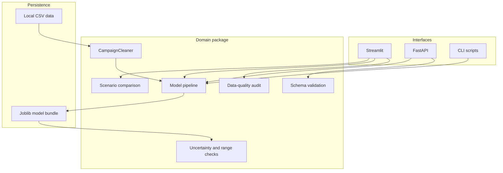

# Architecture

InfluenceLift AI separates interface code from reusable domain logic.

## Design decisions

- Cleaning is implemented as a scikit-learn transformer so training and inference cannot drift apart.
- The saved artifact is a model bundle containing the pipeline, validation metrics, residual interval, model version, and training ranges.
- Interfaces use the package API instead of duplicating transformations.
- The application creates a deterministic synthetic demo model when no local artifact exists, which makes the repository runnable after installation.
- Original datasets stay outside version control unless redistribution rights are confirmed.
