# System Design Diagram Pack

> Twenty whiteboard-ready diagrams plus defense notes for architecture, data, ML, deployment, security, scale, and operations.

**Author:** Mohit Bhatnagar  
**Collaboration:** Aarushi Rai - marketing analytics framing and portfolio positioning  
**Live app:** https://influencelift-ai.streamlit.app  
**Repository:** https://github.com/mohit231007/influencelift-ai

## 01. System Context

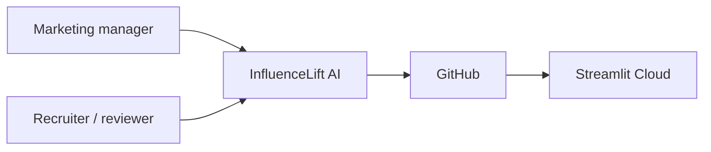

**Defense notes:** Explain responsibility, boundary, evidence, failure mode, and the first 100x-scale change.

## 02. Container Architecture

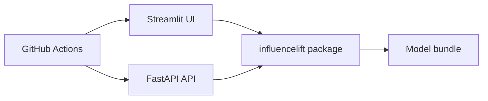

**Defense notes:** Explain responsibility, boundary, evidence, failure mode, and the first 100x-scale change.

## 03. Single Prediction Flow

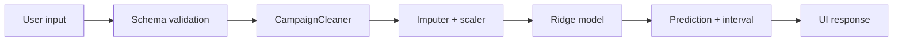

**Defense notes:** Explain responsibility, boundary, evidence, failure mode, and the first 100x-scale change.

## 04. Batch Prediction Flow

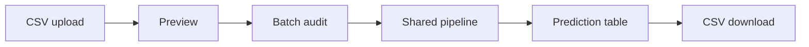

**Defense notes:** Explain responsibility, boundary, evidence, failure mode, and the first 100x-scale change.

## 05. Data Quality Pipeline

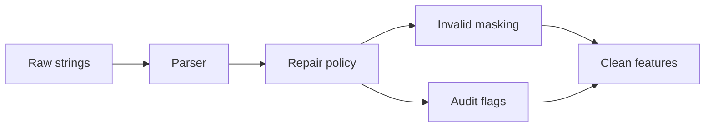

**Defense notes:** Explain responsibility, boundary, evidence, failure mode, and the first 100x-scale change.

## 06. Training Pipeline

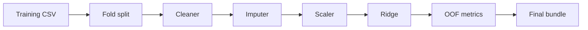

**Defense notes:** Explain responsibility, boundary, evidence, failure mode, and the first 100x-scale change.

## 07. Model Selection Loop

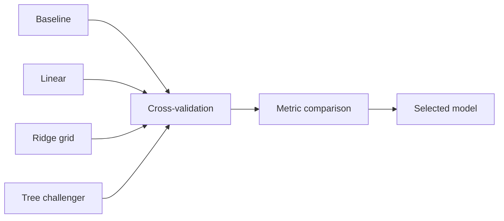

**Defense notes:** Explain responsibility, boundary, evidence, failure mode, and the first 100x-scale change.

## 08. Prediction Uncertainty

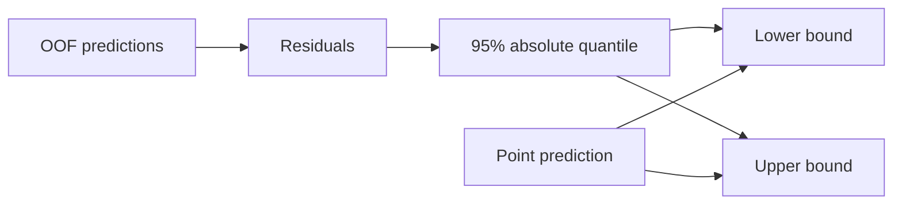

**Defense notes:** Explain responsibility, boundary, evidence, failure mode, and the first 100x-scale change.

## 09. API Request Sequence

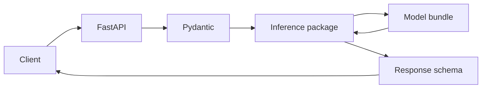

**Defense notes:** Explain responsibility, boundary, evidence, failure mode, and the first 100x-scale change.

## 10. Scenario Simulation

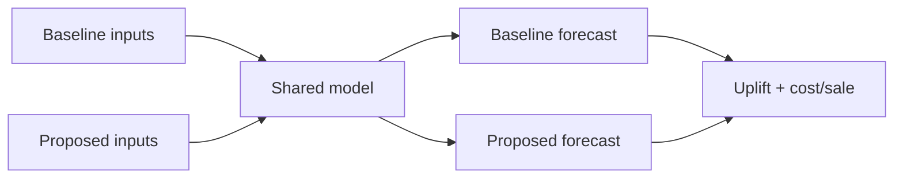

**Defense notes:** Explain responsibility, boundary, evidence, failure mode, and the first 100x-scale change.

## 11. Deployment Topology

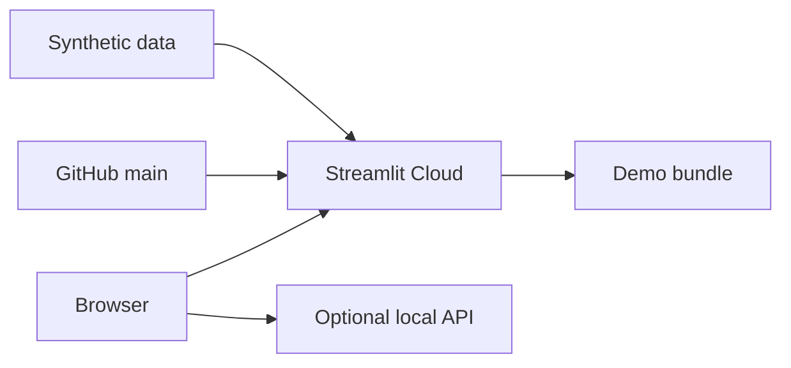

**Defense notes:** Explain responsibility, boundary, evidence, failure mode, and the first 100x-scale change.

## 12. CI/CD Pipeline

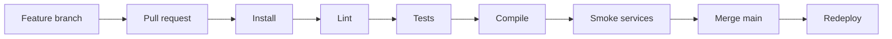

**Defense notes:** Explain responsibility, boundary, evidence, failure mode, and the first 100x-scale change.

## 13. Observability Model

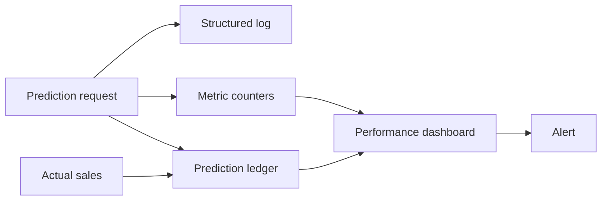

**Defense notes:** Explain responsibility, boundary, evidence, failure mode, and the first 100x-scale change.

## 14. Security Boundaries

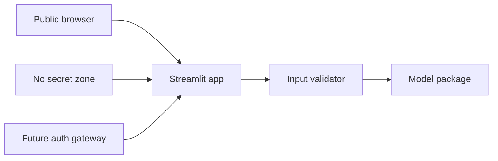

**Defense notes:** Explain responsibility, boundary, evidence, failure mode, and the first 100x-scale change.

## 15. Threat Model

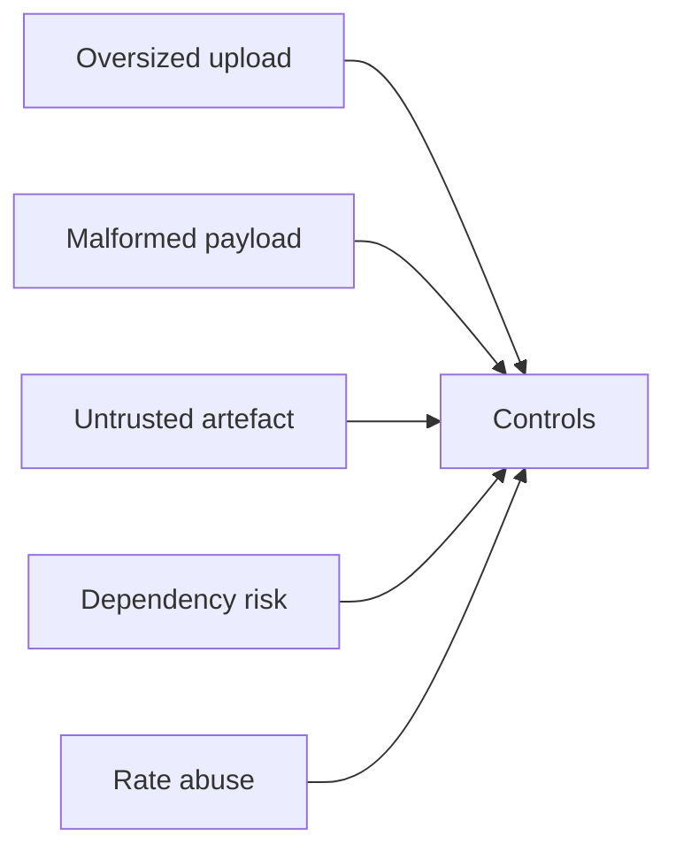

**Defense notes:** Explain responsibility, boundary, evidence, failure mode, and the first 100x-scale change.

## 16. Scale-out Architecture

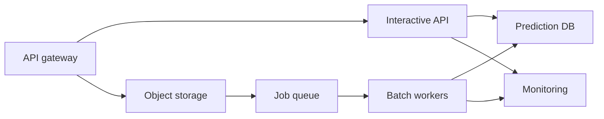

**Defense notes:** Explain responsibility, boundary, evidence, failure mode, and the first 100x-scale change.

## 17. Model Lifecycle

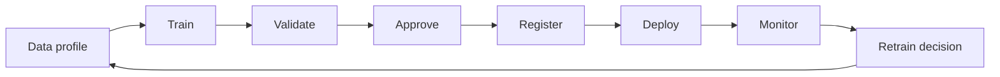

**Defense notes:** Explain responsibility, boundary, evidence, failure mode, and the first 100x-scale change.

## 18. Failure Handling

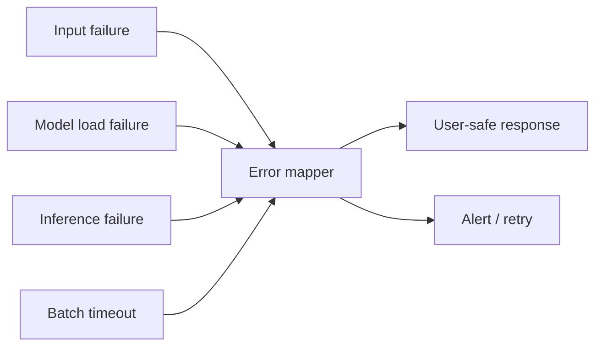

**Defense notes:** Explain responsibility, boundary, evidence, failure mode, and the first 100x-scale change.

## 19. Data Storage Future

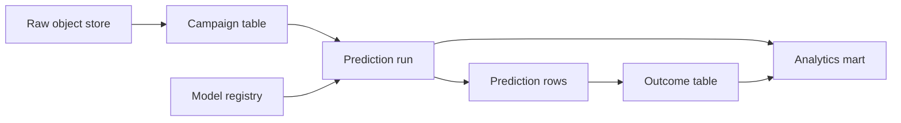

**Defense notes:** Explain responsibility, boundary, evidence, failure mode, and the first 100x-scale change.

## 20. Roadmap Evolution

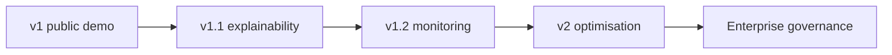

**Defense notes:** Explain responsibility, boundary, evidence, failure mode, and the first 100x-scale change.
